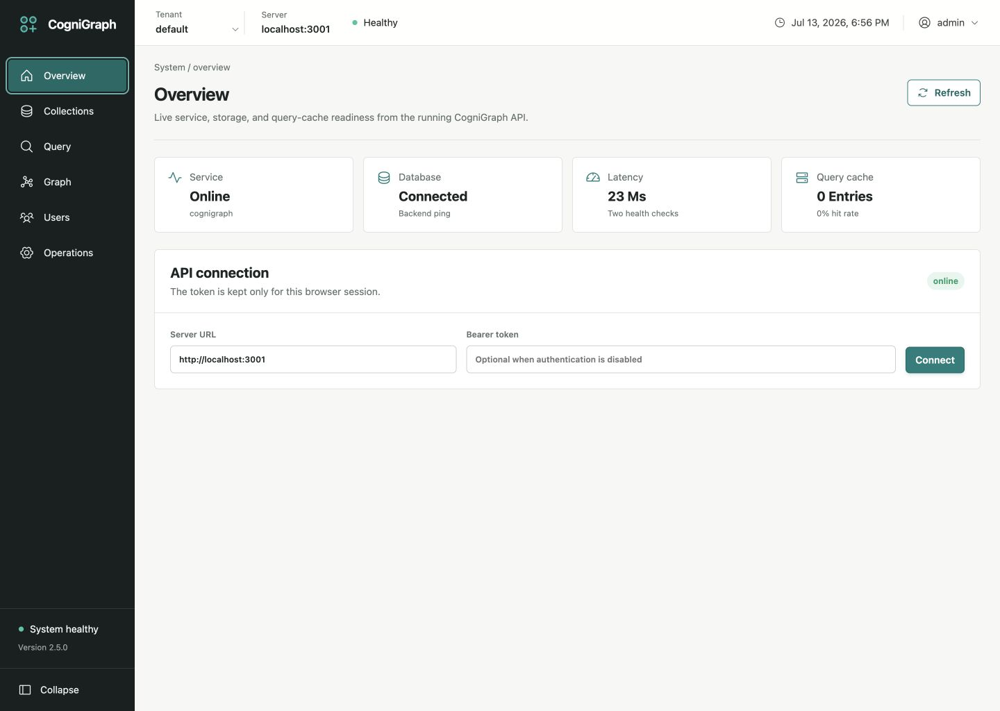
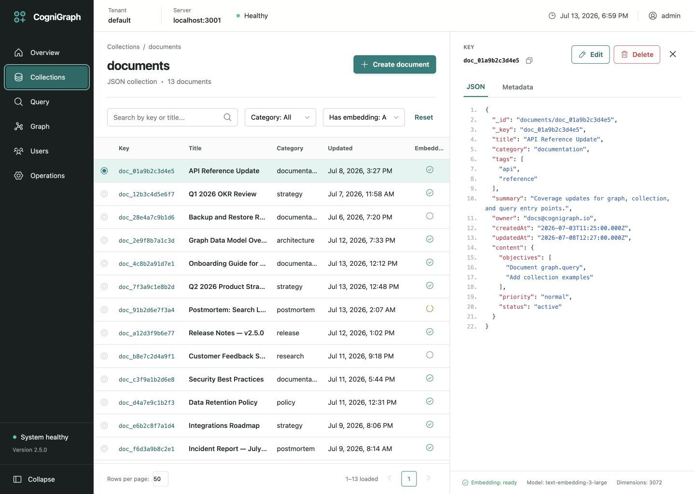
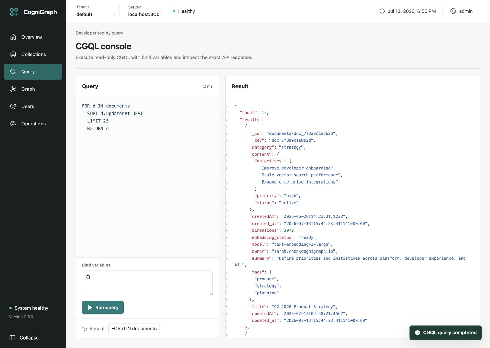
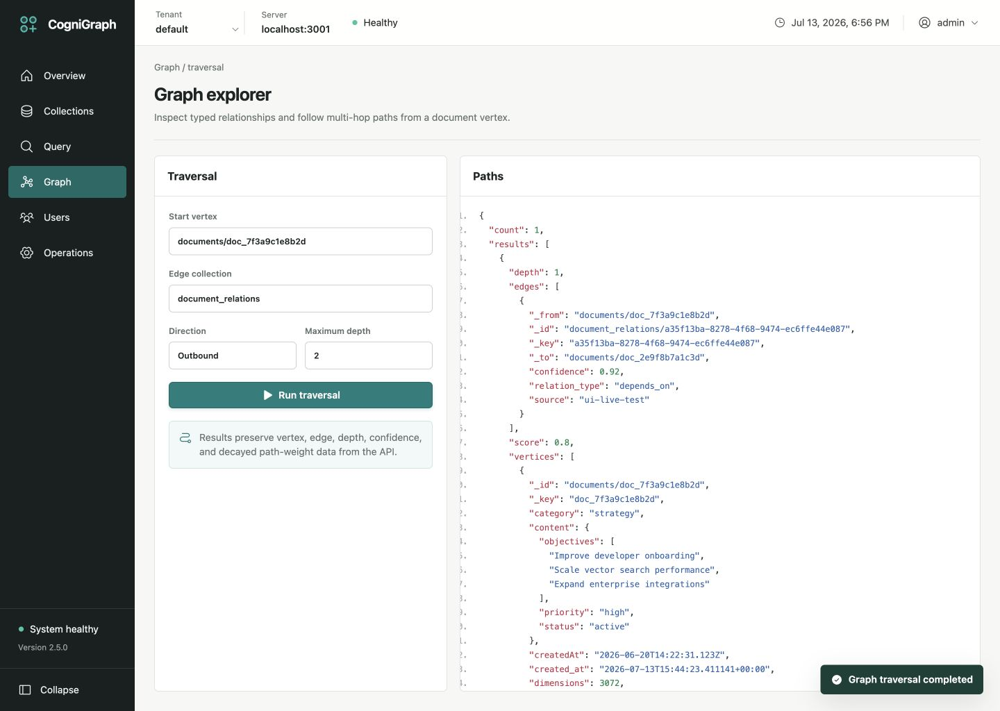
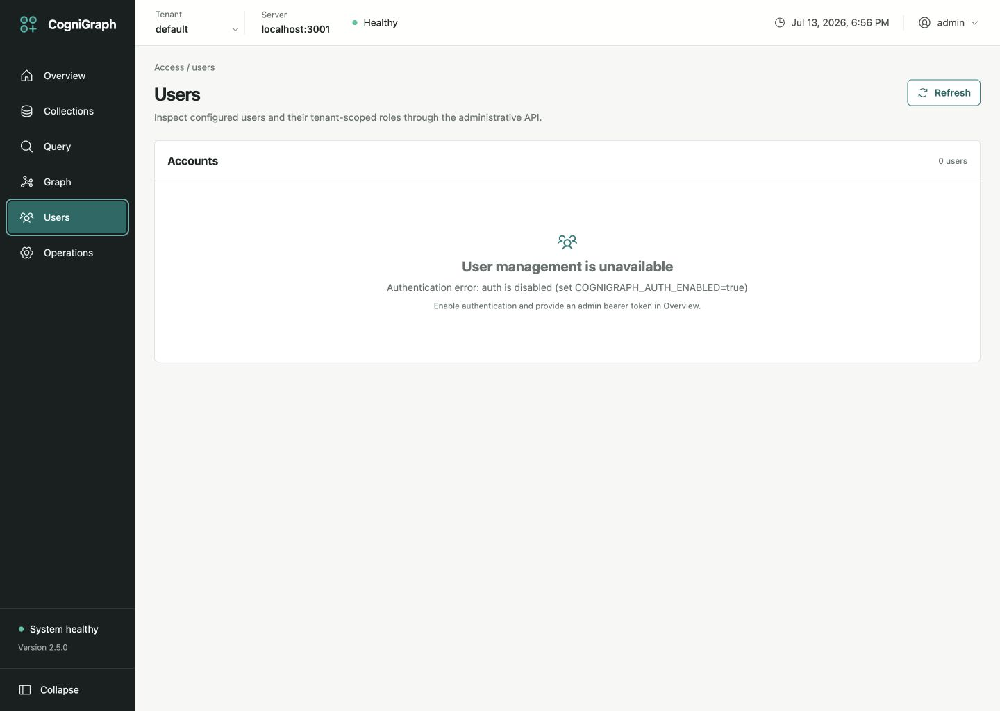
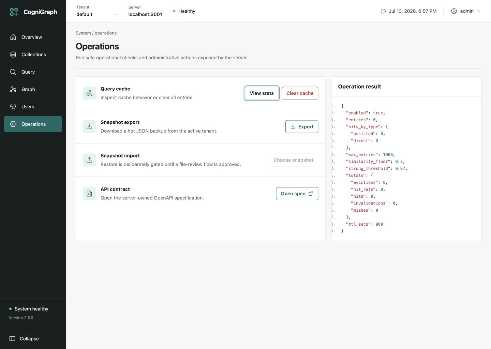

# CogniGraph Management UI Audit

- Date: 2026-07-13
- Viewport: 1440 x 1024 CSS pixels
- Runtime: Bun UI on `http://localhost:3000/`, release API on `http://localhost:3001/`
- Scope: all six primary navigation pages against the live seeded API
- User goal: inspect and manage a CogniGraph instance without misleading or broken controls
- Accessibility target: semantic desktop controls, keyboard-reachable actions, visible focus, and readable status/error states; this is not a full WCAG conformance audit

## Flow Review

### 1. Overview — healthy

The operational summary is clear, uses real health/cache/document data, and keeps the most important server state above the fold. No clipping, overlap, console warning, or dead primary action was found.

### 2. Collections — healthy after fixes

The dense document table, search/filter controls, selection, and JSON inspector remain coherent at the target viewport. The rows-per-page selector previously looked interactive without changing the request; it now controls the API limit. The create action's false dropdown affordance was removed.

Post-fix state:

### 3. Query — healthy after gutter fix

The query-to-result relationship is understandable and the read-only scope is explicit. The JSON result's ordered-list markers were clipped by a component padding override. The result gutter now reserves 52 pixels and uses outside list markers, keeping every line number visible.

Post-fix state:

### 4. Graph — healthy after shared gutter fix

Traversal parameters, execution action, and path result are grouped well. It shared the same JSON result gutter defect as Query; the common result style fix corrected this page too.

### 5. Users — healthy guarded state

The screen correctly refuses to imply user-management availability when authentication is disabled. The raw server error was replaced by a concise state and an actionable configuration hint.

### 6. Operations — healthy after shared gutter fix

Cache statistics, snapshot export, API contract access, and destructive cache clearing have clear boundaries. It shared the result gutter defect, which is corrected by the common style. Destructive cache clearing still requires confirmation.

## Findings and Resolutions

- [P2] JSON line numbers were clipped in Query, Graph, and Operations because `.result-body .json-code` replaced the base gutter padding. Resolved with an explicit 52-pixel left gutter and outside markers.
- [P2] The visible sidebar collapse action did nothing. Resolved with a real 72-pixel collapsed state, an Expand action, and an updated accessible label.
- [P2] Rows per page did not affect document loading. Resolved by making it a controlled value passed to the document-list API limit.
- [P3] Tenant, admin, and create controls used dropdown carets without available menus. Resolved by removing false affordances and explaining that tenant identity comes from the auth token.
- [P3] The Users page exposed a technical auth-disabled error. Resolved with a human-readable state and the relevant server configuration key.

## Accessibility and UX Notes

- Primary controls are native buttons, inputs, and selects with accessible names.
- The collapsed navigation retains icon labels through `aria-label` and `title` attributes.
- Status is communicated with text in addition to color.
- Keyboard focus styling remains visible.
- No browser console warnings or errors were present after the fixes.
- Mobile and tablet behavior was not scored because the approved source visual only defines a desktop management console.

## Verification Evidence

- Cross-page contact sheet: `00-contact-sheet.png`
- Working collapsed navigation: `08-sidebar-collapsed.png`
- Source-to-implementation comparison: `../design-qa-comparison.png`
- Automated gate: Biome checks, Bun tests, and production build pass.

Final result: passed with the documented fixes applied.
